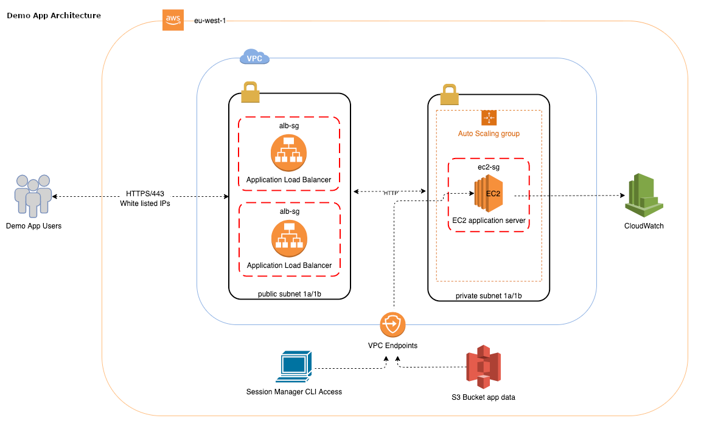

# Demo App

## Required Specs:

* Access to S3 to get static resources (assuming app config not web assets such CSS)
    * bucket name passed as input variable
    * EC2 instance role has appropriate IAM permissions
* Latest Ubuntu 20.04 AMI
* Listens on a TCP port 80 (SSL would be used in real-world) - sample nginx server used as demo app
* 15GiB volume size - configurable per environment via input variable
* t3a.small instance type, 2GiB of memory and 2 vCPUs - configurable per environment via input variable
* HTTPS endpoint via ALB with self-signed ACM certificate
* IP whitelist access to the website using security group o ALB - configurable per environment via input variable
* CloudWatch agent installed on the EC2 instance
    * application logs (nginx) push to CloudWatch Logs
    * Basic EC2 CloudWatch metrics including free disk space and memory   
* Hosted in the Europe Ireland region eu-west-1

## Deploy Infrastructure

This example does not use Terragrunt. To separate different deploy environments such as `dev` and `prod` use Terraform 
workspaces. To get started create a `dev` workspace and initialize:

```bash
$ cd demo # Terraform files are found here
$ terraform workspace new dev
$ terraform init
```

You can now either `terraform plan` or `terraform apply` the infrastructure. 

NB, If more than 20 self-signed certificates have been imported in the past year you may hit an AWS resource limit.

## Infrastructure Diagram



## EC2 CLI Access via Session Manager
You can access the EC2 command line using Session Manager as the agent is installed by default on the latest Ubuntu AMIs
and the EC2 instance role has the correct IAM polices attached and VPC endpoints in place for private subnet access. 

```bash
$ aws ssm start-session --target <EC2_INSTANCE_ID>
```